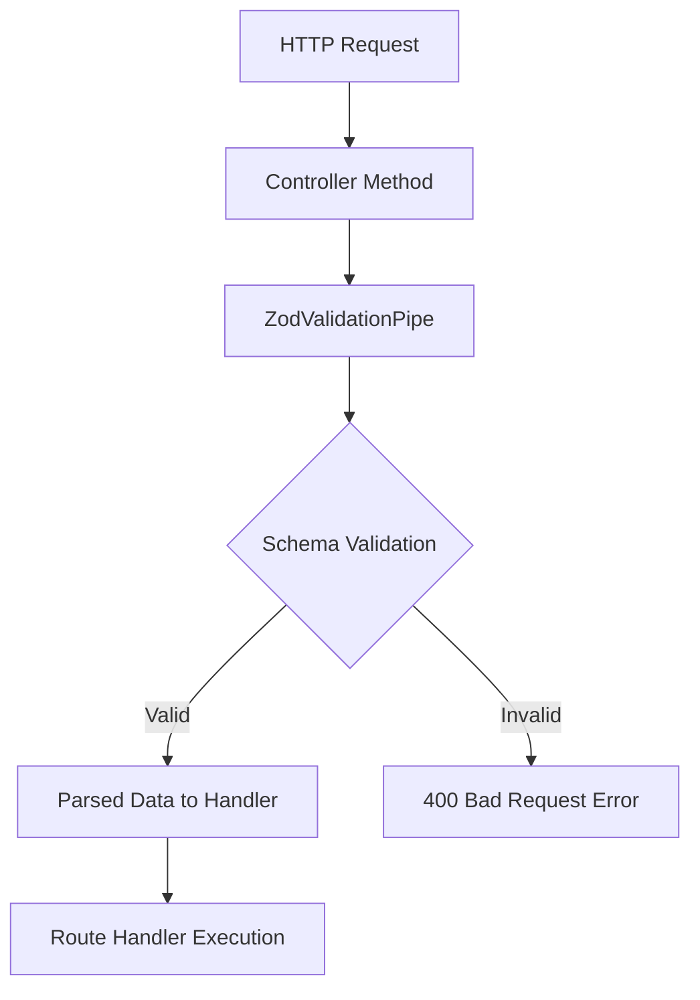

# Migration from TypeORM to Drizzle ORM

## Context

Previously created story from 1.1.project-setup-dev-environment.md **Phase 1
(MVP Demo Mode):** was implemented by dev agent using class-validator,
class-transformer and typeORM. TypeOrm was correctly implemented as it was in
the prd, etc.

Validation was implemented by dev agent using class-validator,
class-transformer. That was wrong as it was not in docs/architecture/backend.md.
That file explicitly mentions that we will use zod for validation.

## 🔄 Key Changes Overview

| Component             | From                                | To                             |
| --------------------- | ----------------------------------- | ------------------------------ |
| **ORM**               | TypeORM                             | Drizzle ORM                    |
| **Entity Definition** | Class-based entities                | Drizzle schema files           |
| **Validation**        | class-transformer + class-validator | Zod                            |
| **File Naming**       | Various                             | Standardized naming convention |

## 📁 File Structure & Naming Conventions

### Database Schema Files

- **Format**: `entity-name.table.ts`
- **Example**: `user.table.ts`
- **Purpose**: Define database table structure using Drizzle schema
- **Location**: In the module folder, e.g.
  `apps/api/src/user-management/user.table.ts`

### Validation Schema Files

- **Format**: `entity-name.schema.ts`
- **Example**: `user.schema.ts`
- **Purpose**: Define validation rules using Zod schemas
- **Location**: In the module folder, e.g.
  `apps/api/src/user-management/user.schema.ts`

## 🛡️ Validation System

### ZodValidationPipe Implementation



### How It Works

1. **Injectable Pipe**: Marked with `@Injectable` for NestJS dependency
   injection
2. **Schema Input**: Constructor receives a `ZodSchema` instance
3. **Usage**: Applied per controller method with specific schema
   ```typescript
   @Body(new ZodValidationPipe(userSchema))
   ```
4. **Validation Process**:
   - Runs `schema.parse(value)` on incoming data
   - **Success**: Returns parsed/typed/coerced value to route handler
   - **Failure**: Converts `ZodError` to `BadRequestException` (400 status)
5. **Protection**: Route handler only executes with valid payload

## 📋 Migration Checklist

### Files Requiring Updates

- [ ] `docs/architecture/index.md`
- [ ] `docs/architecture/development.md`
- [ ] `docs/architecture/backend.md`
- might be more files that need to be updated, please check the files that
  mention typeorm and update them

### Implementation Steps

1. Replace TypeORM imports with Drizzle ORM
2. Convert class-based entities to `.table.ts` schema files
3. Replace class-validator/class-transformer with Zod schemas
4. Implement `zod-validation.pipe.ts`
5. Update implementation plan for controller methods to use new validation pipe
6. Update documentation files

## 🎯 Benefits

- **Type Safety**: Enhanced TypeScript support with Drizzle + Zod
- **Performance**: Lighter weight than TypeORM
- **Consistency**: Standardized file naming and structure
- **Validation**: Unified validation approach with better error handling
